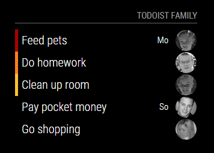
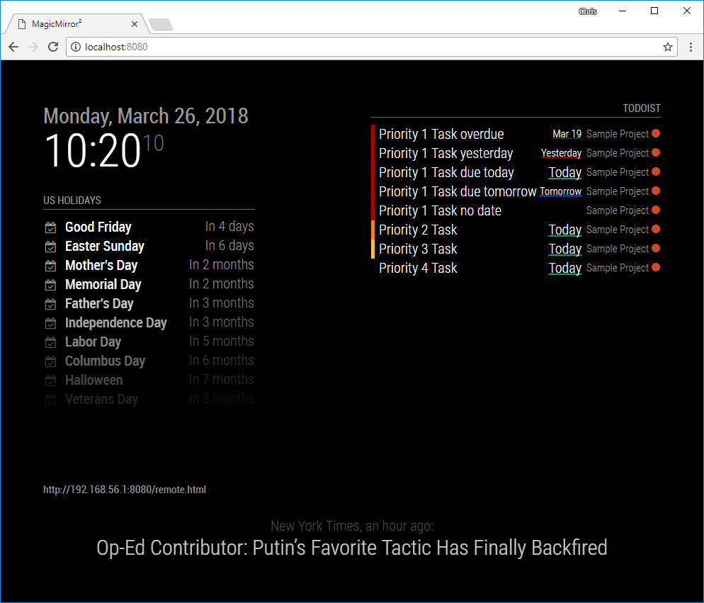
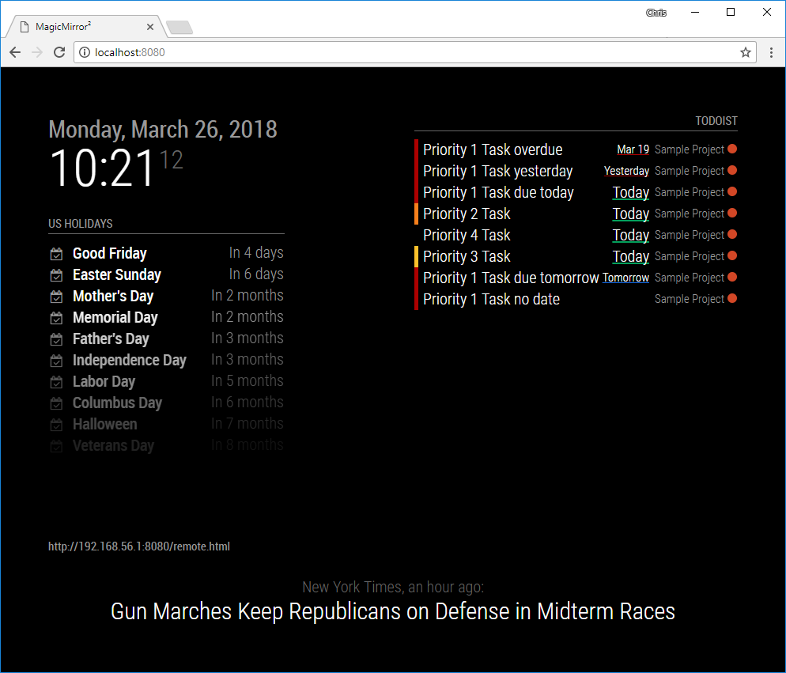
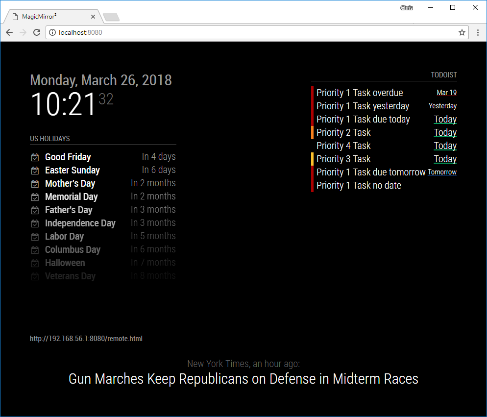
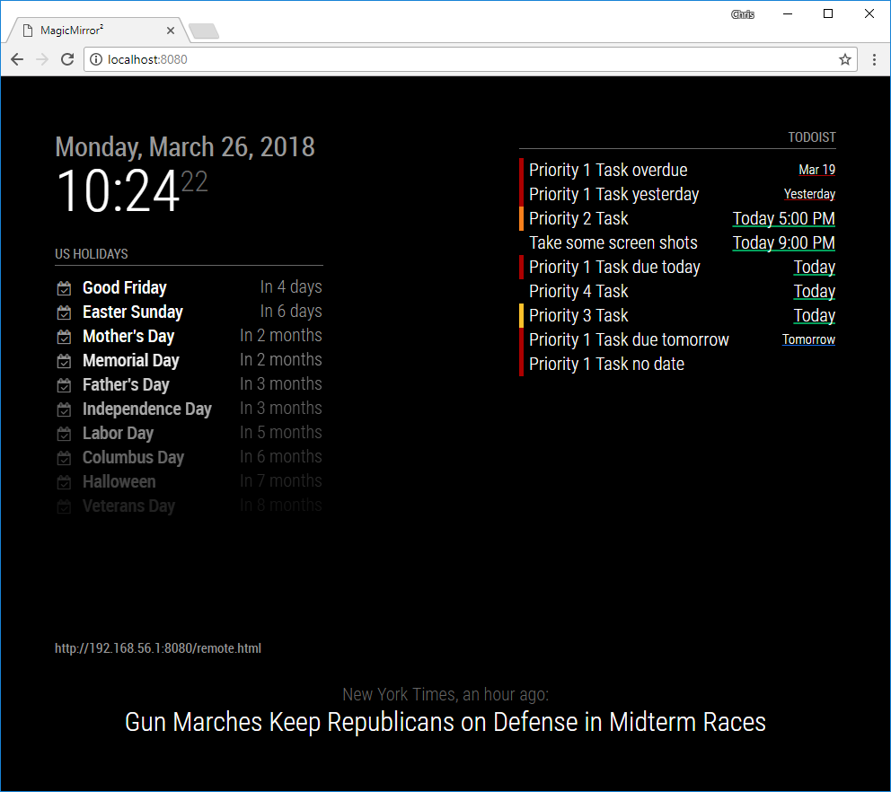
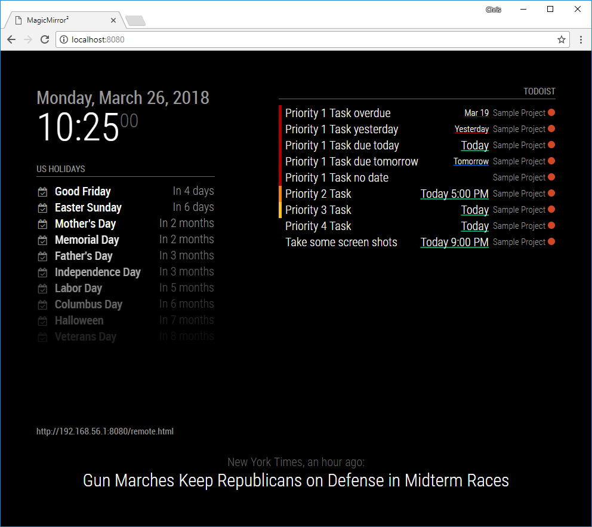
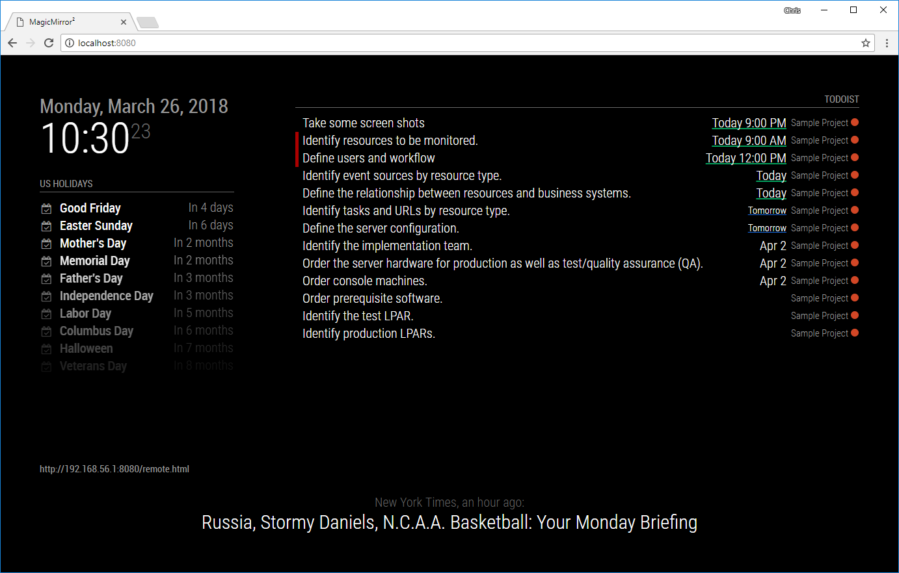
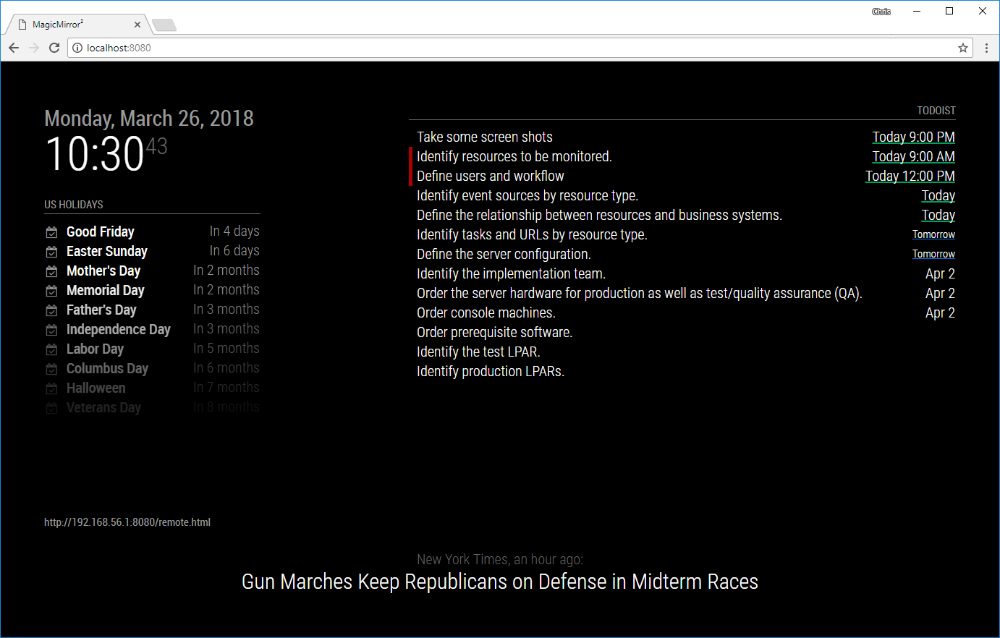

# MMM-Todoist
This is a fork of the original [MMM-Todoist](https://github.com/cbrooker/MMM-Todoist).

This an extension for [MagicMirror²](https://magicmirror.builders). It can display your Todoist tasks. You can add
multiple instances with different lists. Only one account supported. The requests to the server will be paused if
the module is not displayed (use of a carousel or hidden by Remote-Control for example) or by the use of a PIR sensor
and the module MMM-PIR-Sensor. An immediate update occurs at the return of the module display.

## Using the module
See the [installation instructions](INSTALLATION.md) for more details. Add the module to the `modules` array in the `config/config.js` file:

```javascript
modules: [
  // ...
  {
    module: 'MMM-Todoist',
    position: 'top_right',	// This can be any of the regions. Best results in left or right regions.
    header: 'Todoist', // This is optional
    config: { // See 'Configuration options' for more information.
      hideWhenEmpty: false,
      maximumEntries: 60,
      updateInterval: 10 * 60 * 1000, // Update every 10 minutes
      fade: false,
      // projects and/or labels is mandatory:
      projects: [ 166564794 ],
      labels: [ "MagicMirror", "Important" ] // Tasks for any projects with these labels will be shown.
    }
  }
]
```

## Configuration options

The following properties can be configured:

| Option                  | Type         | Default             | Description                                                                                                                                                                                                                                                  |
|-------------------------|--------------|---------------------|--------------------------------------------------------------------------------------------------------------------------------------------------------------------------------------------------------------------------------------------------------------|
| tokenFile               | string       | `token.txt`         | A file containing your Todoist [access token](INSTALLATION.md#access-token). The file is relative to the root of this directory.                                                                                                                             |
| accessToken             | string       | none                | *DEPRECATED* The [access token](INSTALLATION.md#access-token) to use when connecting to the Todoist API. If left unset, the token will be loaded from a file specified by `tokenFile` property.                                                              |
| blacklistProjects       | boolean      | false               | When enabled `projects` becomes a exclusion list.<br>NOTE: If used in combination with `labels`, tasks that are excluded via project may still be shown via the label!                                                                                       |
| projects                | string[]     | []                  | The Todoist [projects](INSTALLATION.md#project-ids) to include tasks from. *This value and/or the labels entry must be specified.* If both projects and labels are specified, then tasks from both will be shown.                                            |
| labels                  | string[]     | []                  | Any tasks with the specified labels will be included. *This value and/or the labels entry must be specified.* If both projects and labels are specified, then tasks from both will be shown.                                                                 |
| maximumEntries          | integer      | 10                  | Maximum number of tasks to be displayed.                                                                                                                                                                                                                     |
| updateInterval          | integer (ms) | 600000 (10 minutes) | How often to connect to the Todoist API to check for updates. Be careful, this is in ms, NOT seconds! So, too low a number will lock you out for repeated server attempts!                                                                                   |
| fade                    | boolean      | true                | Fade (gradient) tasks to black.                                                                                                                                                                                                                              |
| fadePoint               | float        | 0.25                | Where to start any fade. Represented as value between `0` (top) to `1` (bottom).                                                                                                                                                                             |
| fadeMinimumOpacity      | float        | 0.25                | Opacity of the last item if fade is enabled.                                                                                                                                                                                                                 |
| showProject             | boolean      | true                | If enabled, display the project to the right of the DueDates as it does on Todoist.                                                                                                                                                                          |
| sortType                | string       | `todoist`           | The sorting method when displaying your tasks. Possible values: ["todoist", "priority", "dueDateAsc", "dueDateDesc", "ueDateDescPriority"]                                                                                                                   |
| wrapEvents              | boolean      | false               | If enabled, display the long tasks on several lines, according on the value `maxTitleLength`.                                                                                                                                                                |
| maxTitleLength          | integer      | 25                  | The number of lines to cut off at the display that are on several lines.                                                                                                                                                                                     |
| displayLastUpdate       | boolean      | false               | If enabled, display the last update time at the end of the task list.                                                                                                                                                                                        |
| displayLastUpdateFormat | string       | `dd - HH:mm:ss`     | Format to use for the time display if `displayLastUpdate` is enabled.                                                                                                                                                                                        |
| displayTasksWithinDays  | integer      | -1                  | If non-negative, only display tasks with a due date within `displayTasksWithinDays` days. For instance, setting this to 0 will only show tasks due today or overdue. This will not affect tasks without a due date, `displayTasksWithoutDue` controls those. |
| displayTasksWithoutDue  | boolean      | true                | If enabled, display tasks without a due date.                                                                                                                                                                                                                |
| displaySubtasks         | boolean      | true                | If enabled, display subtasks.                                                                                                                                                                                                                                |
| displayAvatar           | boolean      | false               | If enabled, avatar images of collaborators assigned to tasks in shared projects.                                                                                                                                                                             |
| hideWhenEmpty           | boolean      | false               | If enabled, hide the widget when all lists are empty (including header).                                                                                                                                                                                     |

# Screenshots
A few sample Screen Shots to show you what this module looks like. It's fairly configurable and changes considerably depending on how you use Todoist, how many projects you include, and how you sort.

| Options                                   | Screenshot                                 |
|-------------------------------------------|--------------------------------------------|
| `displayAvatar: true`                     |  |
| `orderBy:todoist, showProjects: true`     |        |
| `orderBy:dueDateAsc, showProjects: true`  |        |
| `orderBy:dueDateAsc, showProjects: false` |        |
| `orderBy:todoist, showProjects: false`    |        |
| `orderBy:todoist, showProjects: true`     |        |
| `orderBy:dueDateAsc, showProjects: true`  |        |
| `orderBy:dueDateAsc, showProjects: false` |        |
